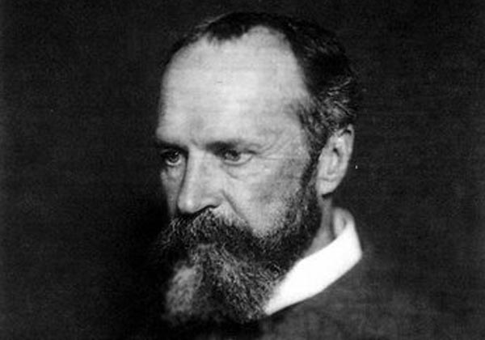
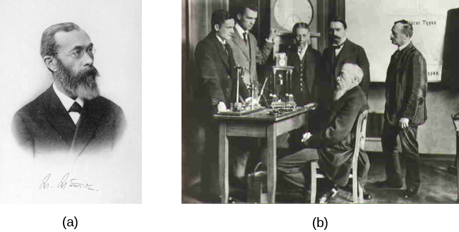

class: inverse, center, middle

```{r setup, include=FALSE}
options(htmltools.dir.version = FALSE)
```

---

# Defining Consciousness...  


---

- Converse with person next to you.

--

- One person first proposes a definition of consciousness.

--

- Then the other finds something wrong with it.

--

- Don't be shy... even ridiculous definitions are wothwhile.

---
  
# Introduction to Your Awareness

![:hline]


---

.pull-left[

]

--

.pull-right[

]

???

"Duck!Rabbit!"

---

.pull-left[


]
.pull-right[


]

---

# Am I Conscious now?


- Write down what you were experiencing 60 seconds ago. (3 sentences)

--

- Look around the room now & describe what you see. (3 sentences)

--

- What did you hear?


---

# Course Schedule

- Fair amount of reading
    - exams & assignments will originate from textbooks 
    - additional papers will be selected for classroom presentations


---

# Assessment & Grading

- Discussion & Participation (15%)
    -  quizzes over reading (*easy*) 

- 5 Assignments (10% each)
    - 2 group presentations
    - 3 response papers

- 3 Exams (15% each)
    - short essay 7-10 questions in each exam


---

# .font60[After this course you will be able to answer these 2 questions:]


.pull-left[

## 


]


???

- What are you aware of now?


---

# .font60[After this course you will be able to answer these 2 questions:]


.pull-left[

## 


]


???

- What were you aware of 30 min ago?

---

# .font60[After this course you will be able to answer these 2 questions:]


.pull-left[

## 


]


.pull-right[

## 


]

???


- Does asking the question affect your awareness?
- How are you aware of your awarness of your sensory experience?


---

# .font60[After this course you will be able to answer these 2 questions:]


.pull-left[

## 


]


.pull-right[

## 


]

???


---


# Science of Consciousness


---

## The problem of other minds

- We know what it is like to be ourselves
- But our experiences are private
- What is it like to be something else?


---

## Thomas Nagel
“What is it like to be a bat?” (1974)

Bats use echolocation.
Can we appreciate what it is like to be a bat?


---

## The hard and easy problems of consciousness

- Hard - why does it feel like something to be me?
- “Easy” - attention, episodic memory, visual perception, etc.
   - David Chalmers


---


## Intentionality: are we always conscious of something?

- Can you be conscious but not conscious of something in particular?


---

## Try this: Being conscious of nothing

Try be conscious of nothing at all. Empty your mind. Do you think it is possible to be conscious without being conscious of anything? If you think it is, how do you know you’re not thinking of anything?


---

## Types of consciousness

- Phenomenal and access consciousness
   - Experiencing v. Attention, memory, language
- Other types of consciousness
- Degrees of consciousness


---

## The history of consciousness research

- Philosophy
- Behaviourism - no mind
- Experimental psychology
- Cognitive science


---

## The Problems (Issues) of Consciousness

- The hard problem
- The temporal problem
- The free will problem
- The why problem
- The self problem
- The unconscious problem
- The cognitive problem
- The binding problem
- The neural correlates problem
- The altered states problem
- The science problem


---
class: center

# Consciousness in Psychology

William James, The Principles of Psychology, Vol. 1, 1890



---
class: center

# Stream of Consciousness


[The Principles of Psychology](https://books.google.com/books?id=JLcAAAAAMAAJ&dq=william%20james&pg=PA279&output=embed")


---

# Introspection 

.pull-left[

Wilhelm Maximillian Wundt
]
.pull-right[


Introspection Experiment

]


---


# Ban on Consciousness

> Consciousness is a word worn smooth by a million tongues. Depending upon the figure of speech chosen it is a state of being, a substance, a process, a place, an epiphenomenon, an emergent aspect of matter, or the only true reality. Maybe we should ban the word for a decade or two until we can develop more precise terms for the several uses which "consciousness" now obscures. - George Miller, 1962.

from *Psychology: The Science of Mental Life.* 


---
class: inverse, center, middle, clear

# Cracking Consciousness 

![:hline]

---

# From Mystery to Experiments

--

**Key 1:** Experimental Definition of Consciousness

--

**Key 2:** Experimental Manipulations (Minimal Contrasts)

--

**Key 3:** Study of Subjective Phenomena (introspection)


---

# To See or Not to See

Important to utilize experiments where:
- objectively, stimuli are identical between conditions
- a minimal contrast requires the difference to be whether the subject was aware (self-report)
- paradigms using the Method of Constant Stimuli define *absolute threshold* as the point where subject reports at 50% correct

---

# Turning Subjectivity Into a Science

Introspection as raw data
- the subjective account of an out of body experience is:
    - a genuine mental event 
    - begs for an explanation

- Understand Mechanisms of Conscious Perception


---

# Signatures of Conscious Thoughts

Ingredients:

1. Conscious access (to see or not to see)
2. Conscious perception manipulation 
3. Carefully recording introspection

Work ingredients into theory (e.g., GNW) 


---

# The Future of Consciousness

- Detecting Consciousness
    - infancy
    - coma patients
    - other species
    - A.I.
    
- Algorithms for Consciousness
    - Functions of consciousness:
        - select
        - amplify
        - propogate 
        - "fame in the brain"


